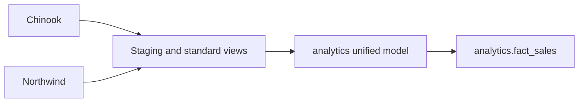

# Chinook + Northwind Integration

An educational MySQL exercise that standardizes two sample databases into one
analytics sales model. It is a checked-in SQL workflow; no runtime execution is
claimed by this README.

## Sources and grain

| Source | Sales grain | Checked-in source |
| --- | --- | --- |
| Chinook | one `InvoiceLine` | [`data/raw/chinook`](data/raw/chinook) |
| Northwind | one `order_details` row | [`data/raw/northwind`](data/raw/northwind) |

The canonical field mapping and source-specific limitations are documented in
[`docs/Source Mapping.md`](docs/Source%20Mapping.md). Source licenses remain
alongside the SQL imports. ERDs: [Chinook](docs/Chinook_ERD.png) and
[Northwind](docs/Northwind_ERD.png).

## Setup and run order

1. Use MySQL and import the two source schemas from `data/raw`.
2. Run scripts in `queries/` in numeric order: source audit, staging, Chinook
   load, Northwind load, standardization, unified model, then fact-sales build.
3. Inspect results in the `analytics` schema.

Keep `source_system` with every row: IDs, currencies and business context are
not interchangeable across the two samples.
